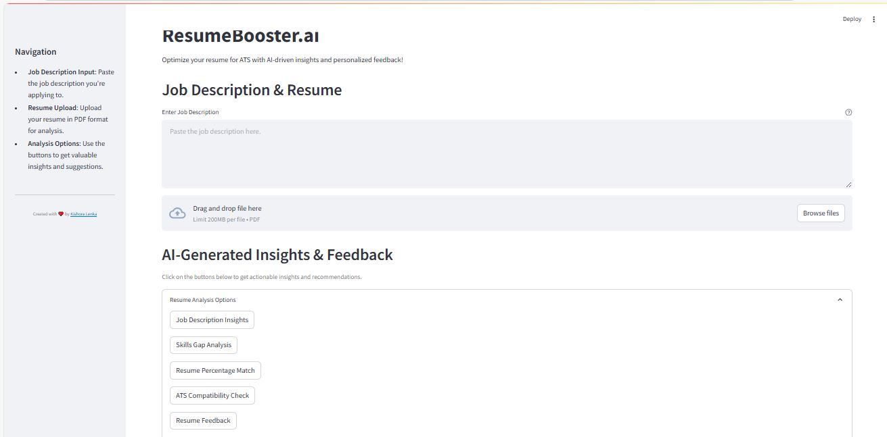

# ResumeBooster
Enhance your resume and be career fit

 # resumeBooster.ai

   ## About The Project

   **resumeBooster.ai** is an GENAI-powered platform designed to optimize cv for applicant tracking systems (ATS). By leveraging the **Google Gemini LLM Model**, the system enhances the likelihood of your resume passing through ATS filters and matching specific job descriptions. 

   ### 𝗙𝗲𝗮𝘁𝘂𝗿𝗲𝘀:
   - 📝 Job Description Insights: Customize your resume to align perfectly with job requirements!
   - 🏆 ATS Compatibility Check: Ensure your resume sails through ATS filters effortlessly!
   - 📉 Skills Gap Analysis: Identify missing skills and bridge the gaps instantly.
   - ✍️ Resume Feedback: Get actionable tips to enhance your resume.
   - 🎯 Resume Match %: Measure how well your resume fits the job description.
   - 📃 Automated Cover Letters: Instantly generate personalized cover letters.
   - 🚀 Generate Optimized Resume: Create a standout, job-winning resume!
   ## Screenshot

   

   ## Demo

   You can view the demo [here]()

   ## Key Technologies

   - **Google Gemini LLM Model**: Advanced AI for analyzing resumes and job descriptions.  
   - **pdf2image**: Converts PDF resumes into images for preprocessing.  
   - **fpdf**: Generates PDFs programmatically for enhanced resume creation.  
   - **PyPDF2**: Extracts, merges, and manipulates PDF content efficiently.  

   ## Use Cases

   - **Resume Optimization**: Tailors resumes to pass Applicant Tracking System (ATS) filters.  
   - **Job Description Analysis**: Analyzes job postings to provide actionable feedback for resume refinement.  
   - **PDF Manipulation**: Simplifies resume uploads and adjustments with seamless PDF processing.  

   ## Why Choose ResumeBooster.ai?

   ✅ **Personalized Feedback**: Provides insights to close skill gaps and align with job requirements.  
   📌 **ATS Compatibility**: Formats and structures resumes to meet ATS standards, improving selection odds.  
   ⚡ **AI-Powered Efficiency**: Uses advanced AI models and tools for precise, automated resume enhancement.
  
   ## Table of Contents

   - [Prerequisites](#prerequisites)
   - [Getting Started](#getting-started)
   - [Contributing](#contributing)
   - [License](#license)
   - [Contact](#contact)
   - [Acknowledgements](#acknowledgements)


   ### Prerequisites

   Before getting started, make sure you have the following:

   - **GOOGLE GEMINI API Key**: You’ll need an API key for interaction with the Google Gemini LLM.

   ### Getting Started

   To get started with this project locally, you’ll need Python 3.10+ installed on your machine along with the necessary Python packages. You can either clone the repository and install dependencies manually or use Docker for an isolated environment.

   ## Installation Steps

   1. **Clone the repository**:
      - Open your terminal or command prompt.
      - Navigate to the directory where you want to install the project.
      - Run the following command to clone the GitHub repository:
      ```bash
      git clone https://github.com/KishieKube/resumeBooster.ai
      ```

   2. **Create a Virtual Environment (Optional)**:
      - It's recommended to use a virtual environment to manage dependencies. Run the following command:
      ```bash
      conda create -p <Environment_Name> python==<python version> -y
      ```

   3. **Activate the Virtual Environment (Optional)**:
      - Activate the virtual environment based on your operating system:
      ```bash
      conda activate <Environment_Name>/
      ```

   4. **Install Dependencies**:
      - Navigate to the project directory:
      ```bash
      cd [project_directory]
      ```
      - Run the following command to install project dependencies:
      ```bash
      pip install -r requirements.txt
      ```

   5. **Create `.env` file and add your API keys**:
      - Create a `.env` file in the root directory and add your Google Gemini API key for LLM interaction.

   6. **Run the Project**:
      - To start the application, run the following command:
      ```bash
      streamlit run app.py
      ```

   7. **Access the Project**:
      - Visit `http://localhost:8501` in your browser to use the app.


   ## Contributing

   Contributions to the Google Gemini-Pro Chat Application are welcome! If you have suggestions, enhancements, or bug fixes, please follow the steps below:

   1. Fork the project.
   2. Create your feature branch (`git checkout -b feature/YourFeature`).
   3. Commit your changes (`git commit -m 'Add some feature'`).
   4. Push to the branch (`git push origin feature/YourFeature`).
   5. Open a pull request.
